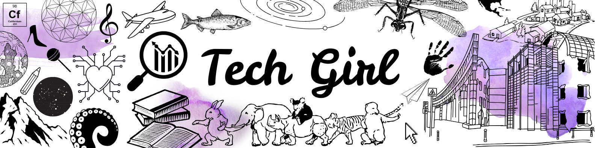

# Hi, I'm Yessamin!🐭

## A junior Java Full Stack Developer and Data Analyst.

I'm very curious and nothing fascinates me more than learning new things, especially about technology and society.
I'm looking to join a team where I can continue learning, applying my knowledge, and collaborating to achieve goals, mainly in front-end and data analysis.

---

## Technical Skills:

### 💻 Languages & Frameworks

  
  
  
  
  
  
  

### 🗄️ Databases 

  

### 🛠️ Tools & Platforms

  
  
  
  

---
## 📊 Stats

<!-- Most Used Languages -->

---

### 🤝 Let's connect!

  <!-- LinkedIn -->
  

  <!-- Gmail -->
  

  <!-- Instagram -->
  

<!--
**yessaminandrade/yessaminandrade** is a ✨ _special_ ✨ repository because its `README.md` (this file) appears on your GitHub profile.

Here are some ideas to get you started:

- 🔭 I’m currently working on ...
- 🌱 I’m currently learning ...
- 👯 I’m looking to collaborate on ...
- 🤔 I’m looking for help with ...
- 💬 Ask me about ...
- 📫 How to reach me: ...
- 😄 Pronouns: ...
- ⚡ Fun fact: ...
-->
